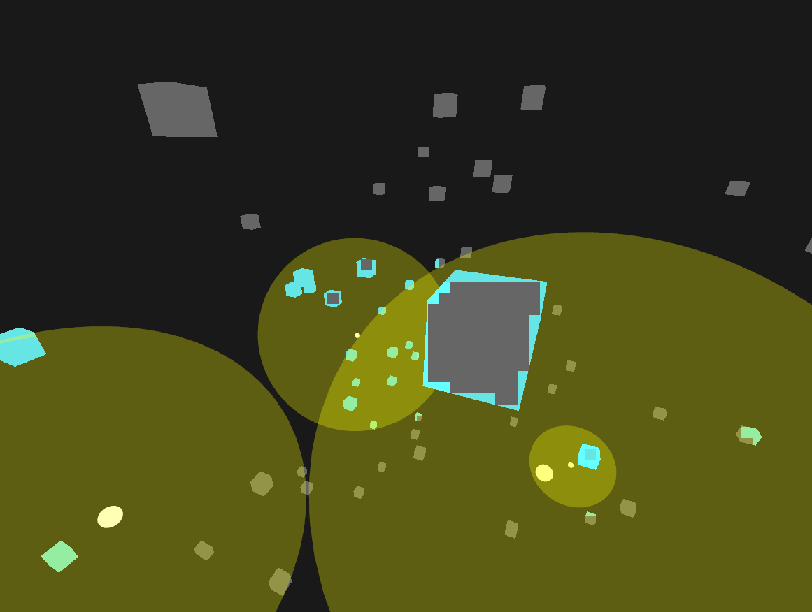

Implements the light binning part of Forward+ rendering. The implementation is based on the blog pos [Forward vs Deferred vs Forward+ Rendering with DirectX 11](https://www.3dgep.com/forward-plus/)
but translated to OpenGL, GLSL and modified for higher efficiency (I have not concluded any benchmarks yet so this claim is unverified).

On the above screenshot is a demo scene including opaque cubes in light grey and lights spheres in yellow. Each light has marked its center with small white sphere and its sphere of influence with transparent yellow.
The light blue color indicates pixels of the opaque cube geometry which are affected by some light ie. the output of the light binning procedure. In a completed Forward+ renderer 
only the pixels in light blue will execute the lighting calculation. 
